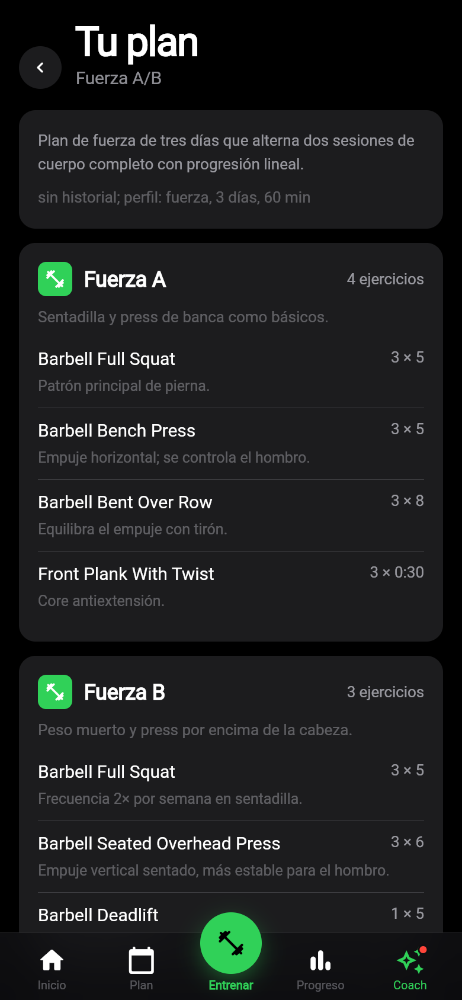
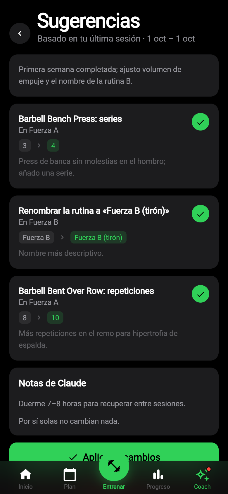
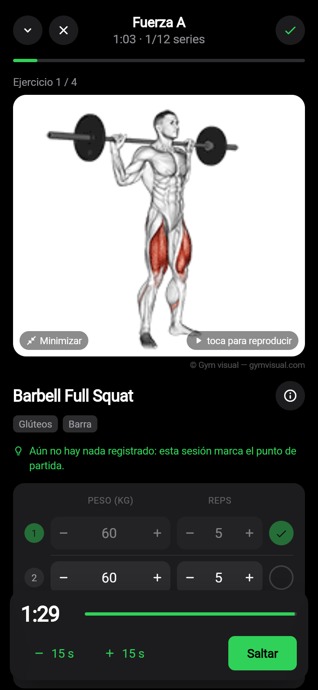
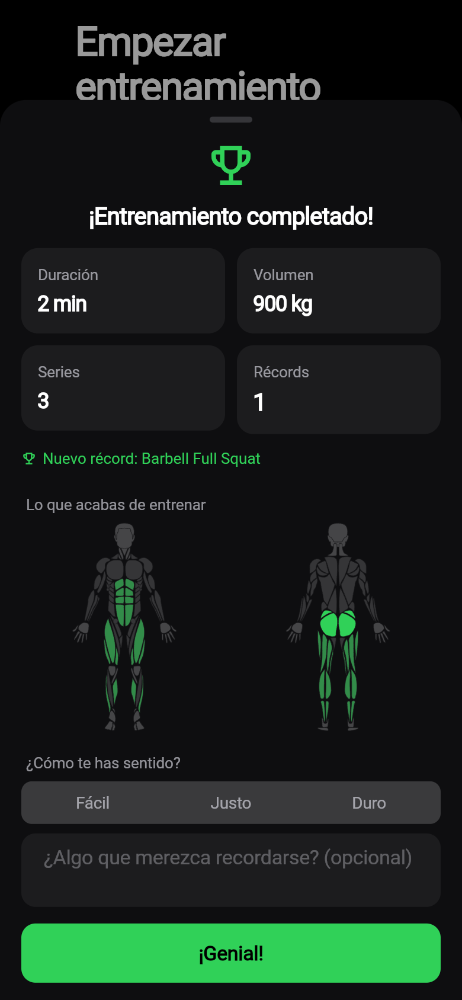
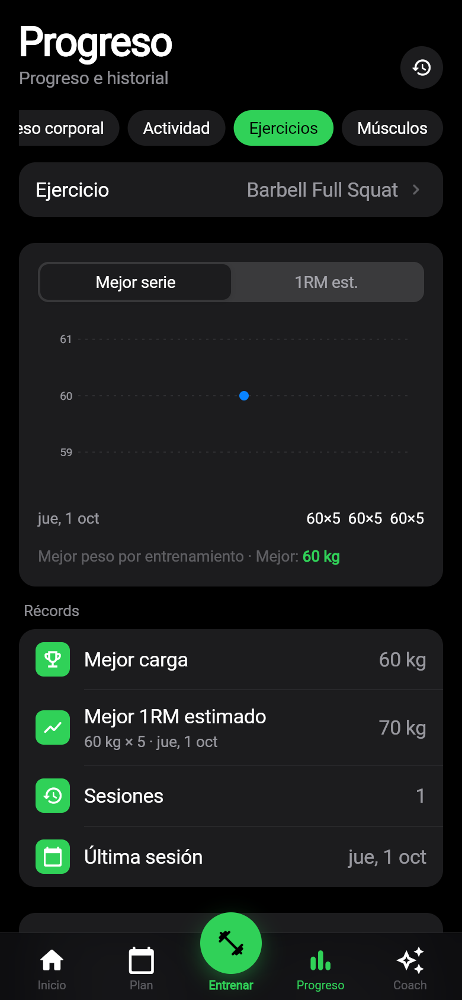

# openGym en Flutter + Cloudflare — guía de instalación

Esta guía pone en marcha las tres piezas:

1. **El backend** — un Worker de Cloudflare en `https://gym.armio.cc` con una base de datos D1.
   Guarda tus entrenos, tu plan y tu peso, y sincroniza la app entre dispositivos.
2. **La app** — la app Flutter (`app/`) para Android e iOS (también compila para web). Funciona
   sin conexión y se sincroniza cuando vuelve a haber red.
3. **Claude** — un conector MCP en `https://gym.armio.cc/mcp`. Claude lee tu progreso y **propone**
   planes y cambios. Nada se aplica hasta que lo aceptas en la pestaña **Coach** de la app.

La arquitectura completa y el contrato entre las piezas están en
[ARCHITECTURE.md](ARCHITECTURE.md).

| Plan propuesto por Claude | Cambios, uno a uno | Entrenamiento guiado | Resumen | Progreso |
|---|---|---|---|---|
|  |  |  |  |  |

---

## 1. Backend (Cloudflare)

### Lo que ya está creado en tu cuenta

| Recurso | Nombre | Id |
|---|---|---|
| Base de datos D1 | `opengym-db` (región ENAM) | `f73efbb2-707b-4ac3-8c8a-fc8213a47d58` |
| Namespace KV (tokens OAuth) | `opengym-oauth` | `00a254cab3df42978057216199e0652b` |
| Worker | `opengym`, en el dominio propio `gym.armio.cc` | — |
| Secreto del Worker | `OWNER_PASSWORD` | — |
| Token de API (cuenta) | `opengym-deploy` | `4677a963ce20c822f53ba368dc56c769` |

El esquema (`cloudflare/migrations/0001_init.sql`) ya está aplicado en `opengym-db` y registrado
como migración, así que `wrangler d1 migrations apply` no lo repetirá. `cloudflare/wrangler.jsonc`
ya apunta a estos recursos y al dominio `gym.armio.cc`.

El Worker ya está desplegado en `https://gym.armio.cc` y la prueba de humo pasa. Lo que sigue solo
hace falta para volver a desplegar (por ejemplo, después de cambiar el código).

### Desplegar

Necesitas Node 22 y acceso a la cuenta de Cloudflare donde está la zona `armio.cc`.

```sh
cd cloudflare
npm ci
npx wrangler login

# La contraseña del dueño (mínimo 12 caracteres). Sirve para entrar en la app
# y para autorizar a Claude. Guárdala en tu gestor de contraseñas.
npx wrangler secret put OWNER_PASSWORD

npm run db:migrate:remote   # debe decir que no hay migraciones pendientes
npm run deploy              # crea gym.armio.cc (DNS + certificado) y publica el Worker
```

O todo en un paso, sin `wrangler login`, con un token de API de Cloudflare. El token necesita
**Workers Scripts: Edit** en la cuenta, **Workers Routes: Edit** en la zona `armio.cc` y
**D1: Edit**:

```sh
export CLOUDFLARE_API_TOKEN=… CLOUDFLARE_ACCOUNT_ID=… OPENGYM_OWNER_PASSWORD=…
scripts/deploy.sh    # migraciones, deploy, secreto OWNER_PASSWORD y prueba de humo
```

#### Crear el token con la CLI `cf`

El token `opengym-deploy` se creó así, con la CLI oficial de Cloudflare
([`cf`](https://github.com/cloudflare/cf)). Es un token **de la cuenta**, sin caducidad, y solo
tiene Workers Scripts Write, Workers Tail Read y D1 Write en la cuenta, y Workers Routes Write en
la zona `armio.cc`:

```sh
npx cf auth login                       # código de dispositivo: se aprueba en el navegador
cat > policies.json <<'EOF'
[
  { "effect": "allow",
    "resources": { "com.cloudflare.api.account.<ACCOUNT_ID>": "*" },
    "permission_groups": [
      { "id": "e086da7e2179491d91ee5f35b3ca210a" },
      { "id": "05880cd1bdc24d8bae0be2136972816b" },
      { "id": "09b2857d1c31407795e75e3fed8617a1" } ] },
  { "effect": "allow",
    "resources": { "com.cloudflare.api.account.zone.<ZONE_ID de armio.cc>": "*" },
    "permission_groups": [ { "id": "28f4b596e7d643029c524985477ae49a" } ] }
]
EOF
npx cf accounts tokens create --name opengym-deploy --policies @policies.json
npx cf auth logout
```

Los ids de los permisos salen de `npx cf accounts tokens permission-groups list`, y los de la zona
de `npx cf zones list`. El valor del token solo se muestra al crearlo: guárdalo (por ejemplo, como
secreto `CLOUDFLARE_API_TOKEN` de GitHub si quieres desplegar desde CI). Para revocarlo, ve al
panel de Cloudflare → *Manage account* → *Account API tokens*.

Comprueba que todo funciona (solo lectura, seguro en producción):

```sh
node scripts/smoke.mjs --origin https://gym.armio.cc --password '<tu OWNER_PASSWORD>'
```

Recorre el login de un dispositivo, una sincronización, el flujo OAuth completo que usa Claude
y las herramientas MCP de lectura.

> **Plan de Workers.** Funciona en el plan gratuito para uso personal, pero se recomienda
> **Workers Paid**: el análisis de muchas semanas de entrenos puede pasar del límite de CPU del plan
> gratuito (10 ms por petición). D1 y KV caben de sobra en los niveles gratuitos.

### Variables (`wrangler.jsonc` → `vars`)

| Variable | Valor | Para qué |
|---|---|---|
| `PUBLIC_ORIGIN` | `https://gym.armio.cc` | El único origen público. Los tokens de Claude quedan ligados a `${PUBLIC_ORIGIN}/mcp`. |
| `APP_ORIGINS` | vacío | Orígenes de navegador que pueden llamar a `/api` (solo si alojas la versión web de la app). La app nativa no lo necesita. |
| `ALLOWED_REDIRECT_HOSTS` | vacío | Hosts extra de redirección OAuth, además de claude.ai, claude.com y localhost. |

`workers_dev` está desactivado a propósito: si el Worker respondiera también en `*.workers.dev`,
un conector añadido con esa URL no funcionaría (los tokens valen para una sola URL).

---

## 2. La app (Flutter)

Requisitos: Flutter 3.47 (stable). Para Android, Android Studio / SDK. Para iPhone, un Mac con
Xcode y tu cuenta de desarrollador para firmar.

```sh
cd app
flutter pub get
flutter run                       # en un teléfono conectado o un emulador
flutter build apk --release       # APK para instalar en Android
flutter build ipa                 # iPhone (configura antes la firma en Xcode)
```

Al abrir la app por primera vez:

1. **Servidor:** `https://gym.armio.cc`
2. **Contraseña:** tu `OWNER_PASSWORD`
3. **Nombre del dispositivo:** p. ej. «iPhone de Mario»

La primera sincronización solo descarga. Si el teléfono ya tenía entrenos de antes, la app
pregunta si quieres subirlos.

### Apple Health (iPhone)

La app se conecta con Salud para:

- **Guardar tus entrenos** en Salud como «Entrenamiento de fuerza», con una estimación de
  calorías. No cuentan para el anillo de Moverse, que solo usa lo que mide el Apple Watch.
- **Sincronizar tu peso** en los dos sentidos: lo que mide tu báscula entra en openGym y lo que
  apuntas en openGym se guarda en Salud. Si cambias o borras un pesaje en openGym, también se
  cambia o borra la copia en Salud.
- **Compartir tu recuperación con Claude:** frecuencia cardiaca en reposo, variabilidad cardiaca
  (VFC) y sueño, un resumen por día que se guarda en tu servidor. Claude lo ve con
  `get_recovery` y en el resumen de `get_overview`.

Para activarlo:

1. Actualiza el código y vuelve a instalar la app (`flutter run --release`). El proyecto ya
   trae el permiso de HealthKit y el identificador `cc.armio.gym`. Si cambiaste
   `project.pbxproj` a mano en Xcode, descarta esos cambios antes de actualizar
   (`git checkout -- ios/Runner.xcodeproj/project.pbxproj`) y vuelve a elegir tu **Team** en
   *Signing & Capabilities*.
2. En la app: **Ajustes → Apple Health → Conectar con Apple Health** y permite todo en la hoja
   de Salud.
3. La primera vez importa los pesos de los últimos 90 días y envía 90 días de recuperación.
   Después se sincroniza cada vez que abres la app.

Ten en cuenta:

- Si ya registras los entrenos con el Apple Watch, desactiva «Guardar entrenos en Salud» para
  no tenerlos dos veces.
- iOS no le dice a la app qué permisos le negaste. Si falta algún dato, revisa *Ajustes del
  iPhone → Salud → Acceso a datos y dispositivos → openGym*.
- Al desactivar «Compartir recuperación con Claude», o al desconectar Apple Health con esa
  opción activa, se borran de tu servidor los datos de recuperación. Lo que ya está en Salud se
  queda allí.

### Traer tus datos de openGym

Si ya usabas openGym, exporta una copia JSON desde la app original (Ajustes → Exportar). Luego, en
esta app, ve a **Ajustes → Importar copia de openGym**. La importación **reemplaza** los datos del
servidor por los de la copia: plan, entrenos, peso, pesos de trabajo y perfil del Coach.

### Versión web (opcional)

`flutter build web` genera `app/build/web`, que puedes alojar, por ejemplo, en Cloudflare Pages.
Alójala en **otro origen** distinto de `gym.armio.cc` y añade ese origen a `APP_ORIGINS`.

---

## 3. Conectar Claude

La URL del conector es:

```
https://gym.armio.cc/mcp
```

- **claude.ai y Claude Desktop:** Configuración → Conectores → *Añadir conector personalizado*.
  Pega la URL y pulsa *Conectar*. Se abrirá la página de autorización de openGym: escribe tu
  `OWNER_PASSWORD` y pulsa **Permitir**. El conector queda disponible en tus conversaciones (y en
  Claude Desktop con la misma cuenta).
- **Claude Code:**
  ```sh
  claude mcp add --transport http opengym https://gym.armio.cc/mcp
  ```
  Después, dentro de Claude Code, `/mcp` → *opengym* → *Authenticate*.

### Qué puede hacer Claude

| Herramienta | Para qué |
|---|---|
| `get_overview` | Punto de partida: perfil, plan actual, estadísticas, peso, pesos de trabajo, propuestas pendientes y decisiones anteriores. |
| `get_training_review` | Análisis de un periodo: sesiones, estancamientos, adherencia, días perdidos, series por grupo muscular, esfuerzo (RIR/RPE) y tendencia del peso. |
| `get_exercise_history`, `list_workouts`, `get_body_weight` | Detalle de un ejercicio, de los entrenos o del peso corporal. |
| `get_recovery` | Tu recuperación desde Apple Health: FC en reposo, VFC y sueño, la última semana comparada con las cuatro anteriores. |
| `search_exercises`, `get_exercise` | Buscar en la biblioteca de 1.324 ejercicios y en tus ejercicios propios (también en español: «pecho», «cuádriceps»…). |
| `update_athlete_profile` | Guardar tus objetivos, días disponibles, duración de sesión, material y limitaciones. |
| `propose_plan` | Proponer un plan semanal completo. |
| `propose_changes` | Proponer cambios concretos al plan actual, cada uno con su motivo. |
| `report_no_change` | Dejar una nota cuando no hace falta cambiar nada. |

También hay tres *prompts* listos: **design_plan**, **refine_plan** y **review_training**.

Ejemplos de lo que puedes pedirle:

- «Diseña mi plan de entrenamiento con openGym: 4 días, 60 minutos, gimnasio completo.»
- «Revisa mis últimas 6 semanas en openGym y propón cambios si hacen falta.»
- «¿Cómo va mi press de banca? ¿Estoy estancado?»
- «Tengo molestias en el hombro; ajusta el plan para no cargar esa zona.»
- «¿Cómo va mi recuperación esta semana? ¿Me conviene una semana de descarga?»

### Cómo se aplican las propuestas

1. Claude valida y guarda la propuesta en el servidor. Si algo no cumple las reglas (un ejercicio
   que no existe, una progresión que no encaja con el tipo de ejercicio…), recibe los errores y la
   corrige.
2. En la app, la pestaña **Coach** muestra la propuesta. Un plan nuevo se acepta o se descarta
   entero, y puedes elegir si reemplaza tu horario semanal. Los cambios se aceptan uno a uno.
3. Cada vez que aceptas algo se guarda una copia de tu plan anterior. **Deshacer los últimos
   cambios del Coach** lo restaura.
4. Claude nunca toca tus entrenos, tu peso ni tus ajustes. Solo puede escribir directamente en tu
   perfil de atleta, y la app te avisa cuando lo hace.

---

## 4. Seguridad

- Una sola contraseña (`OWNER_PASSWORD`) protege la app y la autorización de Claude. Tras
  10 intentos fallidos en 15 minutos desde una IP, se bloquea temporalmente.
- **Ajustes → Dispositivos** lista los dispositivos con sesión y permite revocarlos (por ejemplo,
  un teléfono perdido).
- **Ajustes → Revocar acceso de Claude** invalida todas las autorizaciones del conector. Claude te
  pedirá la contraseña de nuevo la próxima vez.
- Cambiar `OWNER_PASSWORD` **no** revoca los dispositivos ni el acceso de Claude: usa las dos
  opciones anteriores.
- Solo se aceptan redirecciones OAuth a claude.ai, claude.com y localhost (Claude Code). La
  página de autorización no se puede incrustar en otras webs.

---

## 5. Desarrollo local

```sh
cd cloudflare
cp .dev.vars.example .dev.vars          # PUBLIC_ORIGIN=http://localhost:8787 y una OWNER_PASSWORD
npm run db:migrate:local
npm run dev                             # http://localhost:8787
npm run check                           # typecheck + tests (Vitest en workerd)
node scripts/smoke.mjs --origin http://localhost:8787 --password '<.dev.vars>' --write

cd ../app
flutter test && flutter analyze
flutter run -d chrome                   # con APP_ORIGINS=http://localhost:<puerto> en .dev.vars
```

Los motores de progresión en Dart y en TypeScript comparten los fixtures de
`docs/flutter-cloudflare/fixtures/`, que se generan ejecutando el código JS original:
`node docs/flutter-cloudflare/fixtures/tools/generate.mjs`. El catálogo de ejercicios de la app y
del Worker se regenera con `node scripts/build-flutter-cloudflare-data.mjs`.

---

## 6. Problemas frecuentes

| Síntoma | Causa probable |
|---|---|
| Claude dice que no puede conectar / «invalid audience» | La URL del conector no es exactamente `https://gym.armio.cc/mcp` (sin barra final). |
| La página de autorización dice «Servidor mal configurado» | Falta `OWNER_PASSWORD` o tiene menos de 12 caracteres (`wrangler secret put OWNER_PASSWORD`). |
| La app muestra «Se descartó un cambio sin sincronizar» | Editaste el plan sin conexión en un dispositivo mientras otro lo cambió. Gana la versión del servidor; la app te avisa en lugar de sobrescribir en silencio. |
| Una propuesta no se puede aceptar | Necesita conexión. Si dice que usa otra unidad (kg/lb), cambiaste la unidad después de que Claude la creara: pídele una nueva. |
| `429` al entrar | Demasiados intentos con contraseña incorrecta desde tu IP; espera 15 minutos. |
